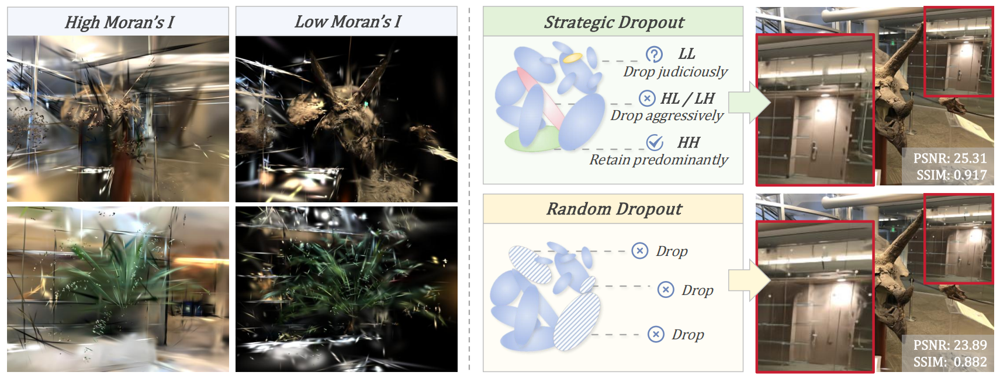

# 

<h1>SpaGS: Spatial Autocorrelation as a Unified Prior for Sparse-View Gaussian Splatting Reconstruction</h1>

## Overview
This is the official code repository for the paper **"SpaGS: Spatial Autocorrelation as a Unified Prior for Sparse-View Gaussian Splatting Reconstruction"**.

The full source code will be released here soon.

